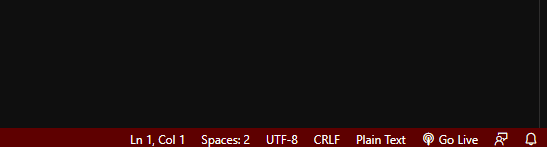
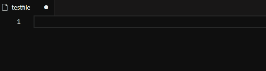

# Emojy

Select and paste your emoji in seconds.

## Usage

Using Emojy is super simple.

#### 1) `Ctrl+Shift+P`

Open your command palette and choose `Select Emoji`

#### 2) Search your emoji

Find emoji you want to use.

#### 3) `Ctrl+V`

Just paste it!

## Contributing

If you find something, feel free to create PR.
